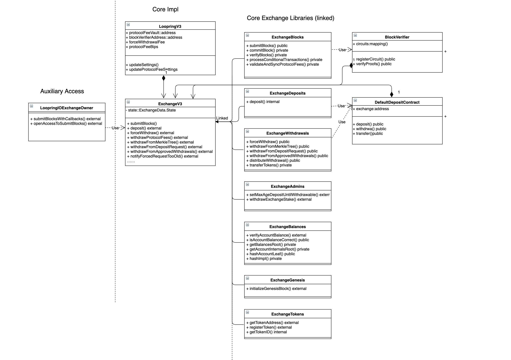
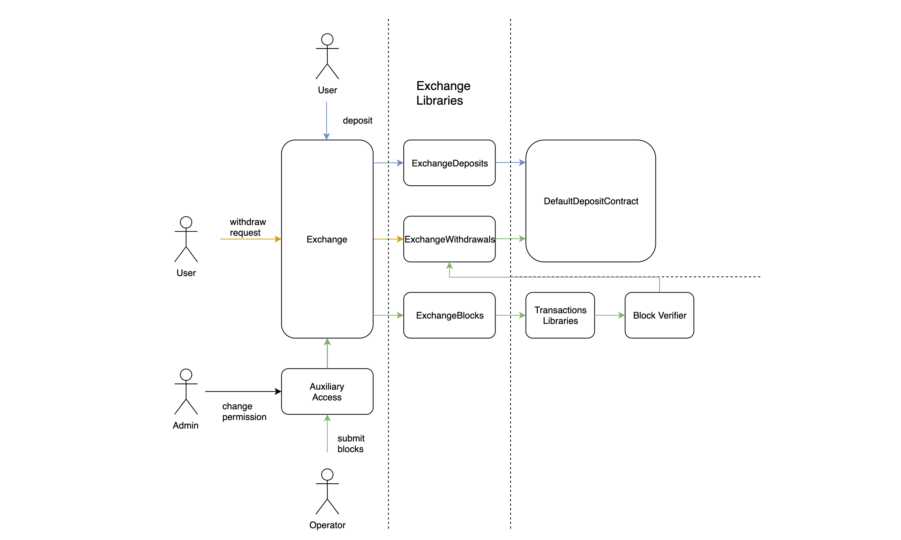

# Loopring and DeGate Contracts

DeGate contracts are developed based on Loopring 3.6.1 version.

The main functions of the contracts are:

1. Deposit:

- User can deposit any type of tokens, there is no whitelist restriction.

2. Withdrawal:

- User can submit off-chain withdrawal to Operator, and get tokens when the request is processed in a block on-chain.
- User can submit force withdrawal on-chain. Operator needs to handle the withdrawal within a limited time. Otherwise, exchange will enter Withdraw mode.
- After entering Withdraw mode, user can withdraw tokens directly from the contract by submitting merkle proof.

3. Block process

- Verify blocks with the given public data and proofs.
- Process conditional transactions (AccountUpdate/Deposit/Withdraw)

# Contract structure

| Contract               | Description                                                               |
| ---------------------- | ------------------------------------------------------------------------- |
| LoopringV3             | Loopring contract，global parameters setting                              |
| ExchangeV3             | Exchange core contract，include several libraries to process block and tx |
| BlockVerifier          | Verifier contract for circuit proofs                                      |
| DefaultDepositContract | Deposit contract, store and transfer funds for exchange                   |

### Contract structure diagram



### Contract usecase diagram



# DeGate added and modified features

## Token registration

1. Anyone can invoke registerToken to register the token.
2. When an unregistered token is deposited, the token is automatically registered.
3. The first 32 Token IDs are registered by owner, and can be used to pay fees.

## Token Number expansion

Number of tokens increases from 2^16 to 2^32, balance tree depth increases from 8 to 16.

## Token Amount expansion

Token Amount increases from 2^96 to 2^248.

## Transaction types in Contract

DeGate defines the following transaction types:
DEPOSIT, WITHDRAWAL, TRANSFER, SPOT_TRADE, ACCOUNT_UPDATE, ORDER_CANCEL, BATCH_SPOT_TRADE, APPKEY_UPDATE.

- AMM and SIGNATURE_VERIFICATION types are removed
- ORDER_CANCEL/BATCH_SPOT_TRADE/APPKEY_UPDATE are added

Only three types of transactions(conditional tx) are processed within contract:
DEPOSIT,WITHDRAWAL and ACCOUNT_UPDATE

## Tx Calldata combination

Tx calldatas are placed in a fixed order in block. Deposit and AccountUpdate txs are placed at the beginning and Withdraw txs are placed at the end.

[Deposit txs][accountupdate txs][Other Txs...][withdraw txs]

- Tx Type is removed from calldata.
- The numbers of three conditional Tx are provided in BlockHeader.

## Merkle tree adjustments

1. StorageRoot is moved from token leaf to account leaf, making StorageRoot as the sibling of TokenRoot.
2. Add simple Asset tree to retain only Account and Balance information.
3. Both roots are stored in contract. In Withdraw mode, the root of the Asset tree is used for Merkle validation.

## ProtocolFeeBip simplify

Merge ProtocolTakerFeeBip and ProtocolMakerFeeBip to one ProtocolFeeBip.
ProtocolFee is defined as the maximum value, provided for circuit validation.

## Gas saving deposit

A user can also deposit funds by transfering tokens to deposit contract directly, called gas saving deposit. In this case, user does not need to call approve.
To validate the deposit tx, the unconfirmed token balance in deposit contract needs to be greater than the deposit amount.

## Deposit charge mode

When there are too many deposits over a period of time, there is a charge for deposit.
Charge parameters are set by owner through setDepositParams interface.

## Poseidon.sol contract

```
uint accountItem = hashAccountLeaf(uint(owner), pubKeyX, pubKeyY, nonce, balancesRoot);
```

Parameters of hashAccountLeaf is changed to 5, and poseids.hash_t6f6p52 is used to calculate AccountLeaf hash.
hash_t6f6p52 function, is generated by generate_poseidon_EVm_code.py.

## Other removed features

1. AMM transaction and pool are removed.
2. Transfer transaction is removed, not a conditional tx now.
3. Agent related interfaces are removed, as we don't support Agent mode.
4. Staking pool is removed.
